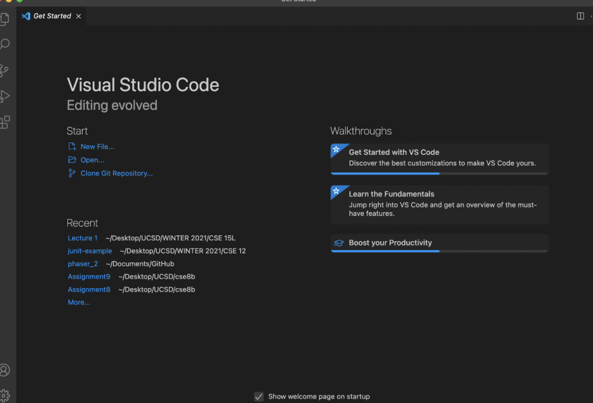
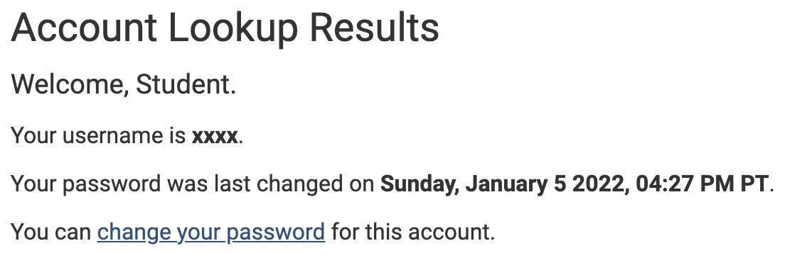
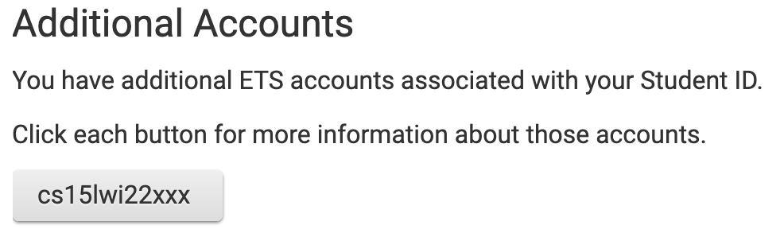
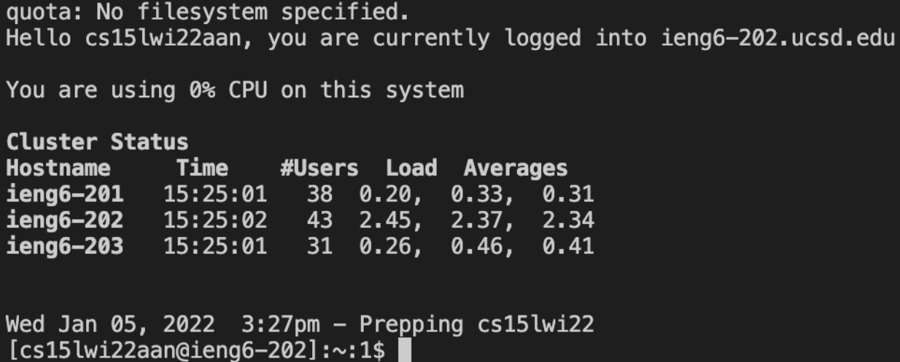
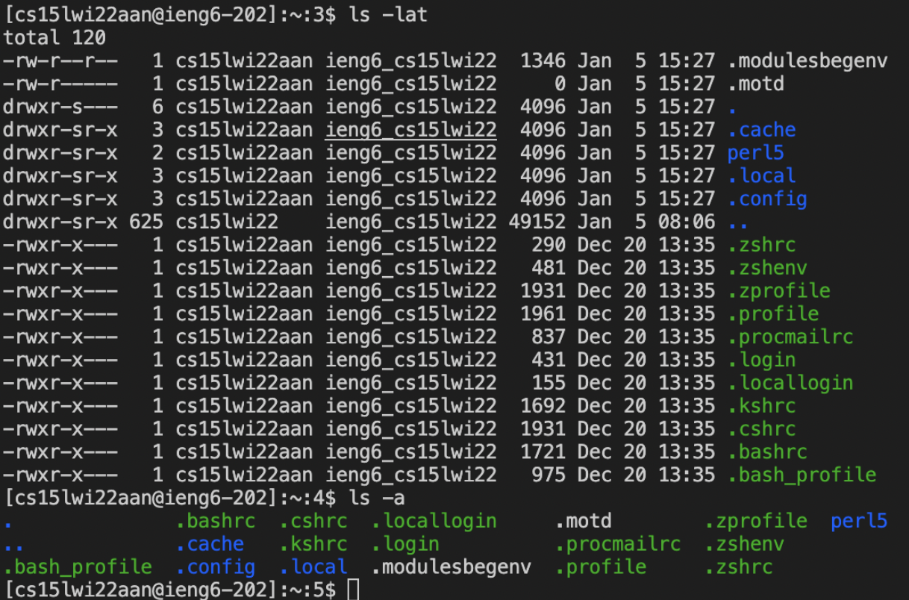

## Part 1. Getting set up

It is recommended to connect through Visual Studios Code. Follow the
link below to learn how to get set up with Visual Studio Code

[Install Visual Studio Code](https://code.visualstudio.com/)

When installed, your open Visual Studio Code:



Look up your course-specific account for CSE15L at this link: [https://sdacs.ucsd.edu/~icc/index.php](https://sdacs.ucsd.edu/~icc/index.php)

If this is your first time, you may need to set up your ETS account for this class by
changing your password.



If your account is set up, locate your account name. Remember the characters after "cs15l22"
(i.e. "xxx"), you wil need these to connect remotely.




If you are on Windows you must first install OpenSSH.
This program will help connect your computer
to other computers with this account.

[Install OpenSSH](https://docs.microsoft.com/en-us/windows-server/administration/openssh/openssh_install_firstuse)

## Part 2. Remotely connecting

Open a terminal in VSCode (Ctrl or Command + ` or use the Terminal → New Terminal menu option)

type the following command into the terminal (but replace xxx with the characters you
retrieved from your account name in a prior step):

`$ ssh cs15lwi22xxx@ieng6.ucsd.edu`

If this is your first time connecting, you should see a message

```
⤇ ssh cs15lwi22zz@ieng6.ucsd.edu
The authenticity of host 'ieng6.ucsd.edu (128.54.70.227)' can't be established.
RSA key fingerprint is SHA256:ksruYwhnYH+sySHnHAtLUHngrPEyZTDl/1x99wUQcec.
Are you sure you want to continue connecting (yes/no/[fingerprint])? 
```

Type `yes` and then enter your password. Your terminal should look something like:



## Part 3. Getting comfortable with your environment

Experiment with some commands! Try the following:

* `cd ~`
* `cd`
* `ls -a`
* `ls -lat`
* `ls <directory>` where `<directory>` is `/home/linux/ieng6/cs15lwi22/cs15lwi22xxx`,
  but the `xxx` is your account specific string of characters
* `cp /home/linux/ieng6/cs15lwi22/public/hello.txt ~/`
* `cat /home/linux/ieng6/cs15lwi22/public/hello.txt`

Your terminal should look something like this after typing in the command `ls -lat` and `ls -a`



To log out:
* Ctr-D
* Run in terminal: `exit`

## Part 4. Moving files over SSH with scp

In this part we'll demonstrate how to copy files back and forth between your computer and the
remote server. We do this through the command `scp`

First, create a file called `WhereAmI.java` and write the following inside:

```
class WhereAmI {
  public static void main(String[] args) {
    System.out.println(System.getProperty("os.name"));
    System.out.println(System.getProperty("user.name"));
    System.out.println(System.getProperty("user.home"));
    System.out.println(System.getProperty("user.dir"));
  }
}
```

Next, in the terminal from the directory where you made this file, run the following:

`$ scp WhereAmI.java cs15lwi22xxx@ieng6.ucsd.edu:~/`

You will be prompted with your password so type it in. Then, run `ls`. You should see the file
is in your home directory! It should look something like this: 


## Part 5. SSH Keys

To avoid having to enter in our password every time we run commands to the remote server, we can implement `ssh` keys. 
We do this through a program called `ssh-keygen` that creates a public key and a private key. After the keys are instantiated
you can copy the public key to a location on the server and the private key to a location on the client. Then `ssh` can verify
your identity with the location of the files, bypassing the password! 

The first step is to enter the following command on your client:

`$ ssh-keygen`

Make sure to leave the passphrase empty and enter the file in which to save the key.

This should generate the keys randomart. It should look something like this: 


If you are on Windows, make sure to follow the `ssh-add` steps here: [https://docs.microsoft.com/en-us/windows-server/administration/openssh/openssh_keymanagement#user-key-generation](https://docs.microsoft.com/en-us/windows-server/administration/openssh/openssh_keymanagement#user-key-generation)

Next, we need to copy the *public key* to the `.ssh` directory on the server. To do so, connect to the server then enter
the following command: 

`$ mkdir .ssh`

Then logout with `$ logout`

When you are back on the client, copy your *public key* to the server. Use this command: 
`scp path cs15lwi22xxx@ieng6.ucsd.edu:~/.ssh/authorized_keys` where "path" is the path to your public key.

Now when you try to connect to the server you wont be prompted with a password! It should look something like this: 


# part 6 - Making remote running more pleasant

Some quick tips!

You can write a command in quotes at the end of an `ssh` call to run it directly on the remote server and then logout. For example:

`ssh cs15lwi22xxx@ieng6.ucsd.edu "ls"`

The result should something like this: 


