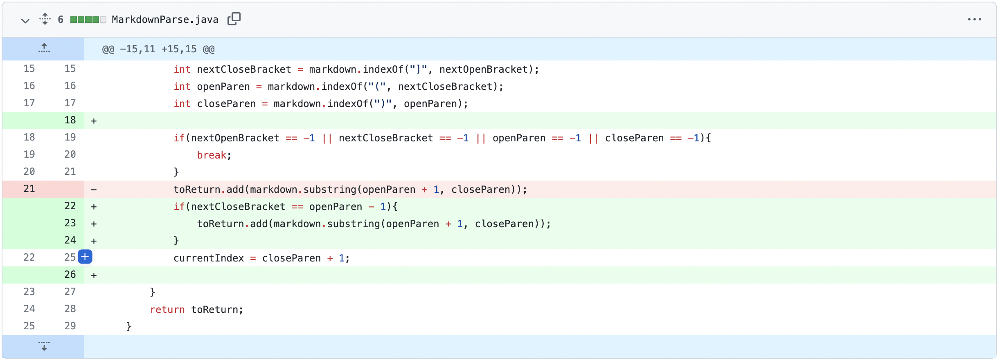

## Bug 1: IndexOutOfBounds Exception with empty markdown file 

**GitHub commit differences:** \

**Failure-inducing input:** \
[test-file2.md](assets2/test-file2.md)

**Symptom of failure-inducing input:**

**Relationship between the bug, the symptom, and the failure-inducing input:** \
The failure-inducing input which caused the symptom of an IndexOutOfBounds Exception was an empty markdown file. 
The bug here was that our program assumed that the markdown file would always have an open parenthesis
followed by a closed parenthesis. When the markdown file is empty, the program still looks for text
in between the indexes of the open and closed parenthesis, however, in this case, these indices are -1. This causes
an IndexOutOfBounds Exception to be thrown. To fix this we added a check that confirms that all the correct link
identifiers exist before looking for a link.

## Bug 2: Non links are detected as links

**GitHub commit differences:** \

**Failure-inducing input:** \
[test-file3.md](assets2/test-file3.md)

**Symptom of failure-inducing input:** \

**Relationship between the bug, the symptom, and the failure-inducing input:** \
The failure-inducing input which caused the symptom of a non-link to be printed was a 
markdown file which contained a set of brackets and a set of parenthesis separated from
each other by text in the middle. The bug here was that our program assumed that a set
of brackets followed by a set of parenthesis always meant a link existed in between the parenthesis.
However, in markdown, the syntax for a link requires that the closed bracket is immediately followed
by an open parenthesis. To account for this, we added a check that confirms that the closed bracket
is one index to the left of the open parenthesis before grabbing a link. 

## Bug 3: Broken links are detected as links

**GitHub commit differences:** \

**Failure-inducing input:** \
[test-file4.md](assets2/test-file4.md)

**Symptom of failure-inducing input:** \

**Relationship between the bug, the symptom, and the failure-inducing input:** \
The failure-inducing input which caused the symptom of a broken link to be printed was
a markdown file which contained a link that had a space in it. The bug here was that our
program assumed that any text in between a set of parenthesis meant it was a viable link.
Links, however, don't contain spaces. To account for this we added a check that confirms that 
the index of a space in the text in between the parenthesis was -1 before adding it to the
toReturn value.
