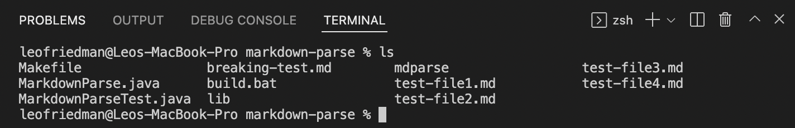
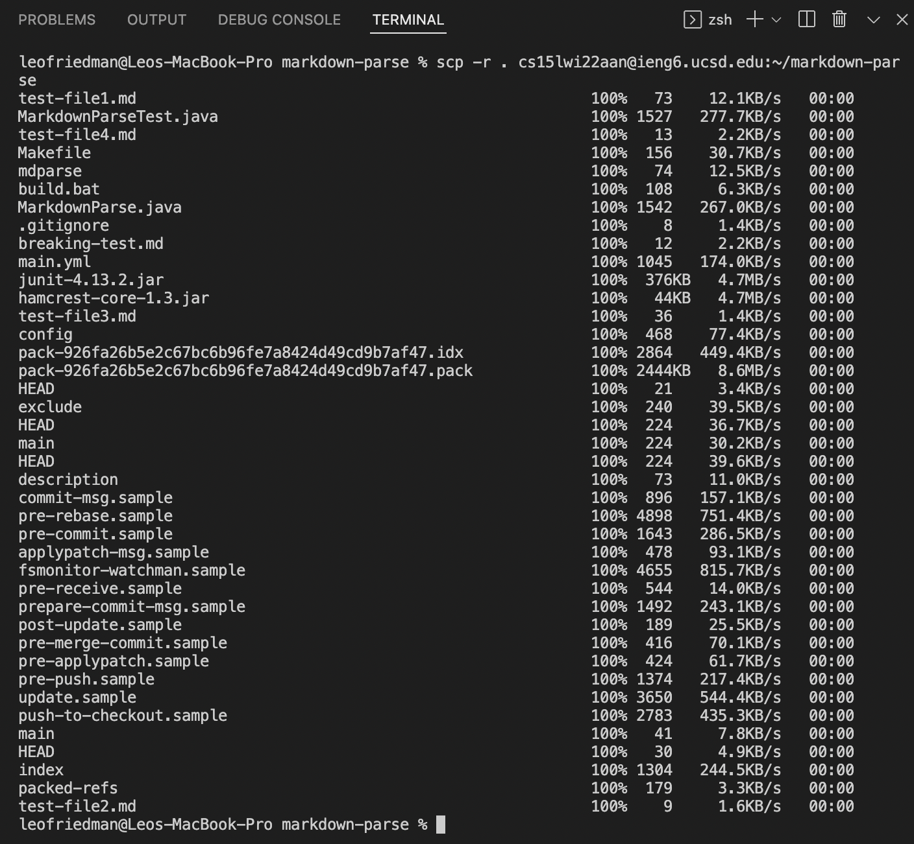
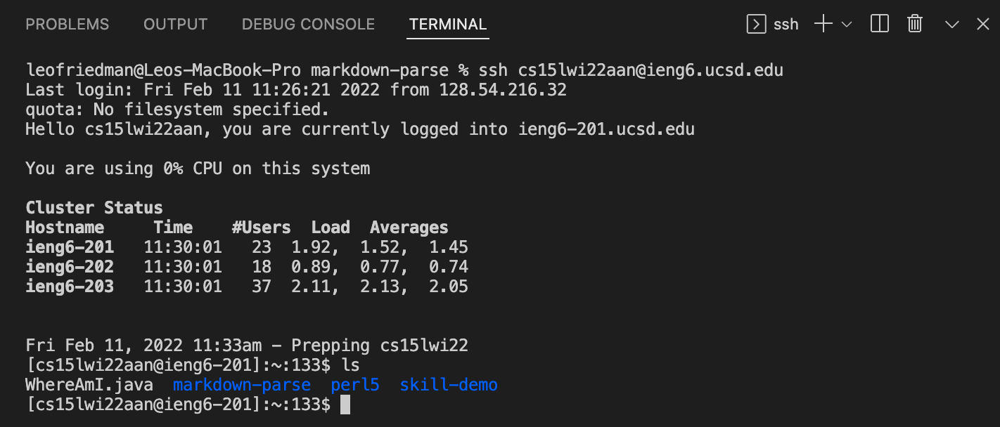
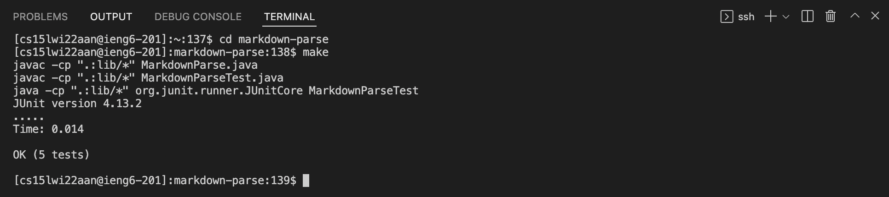
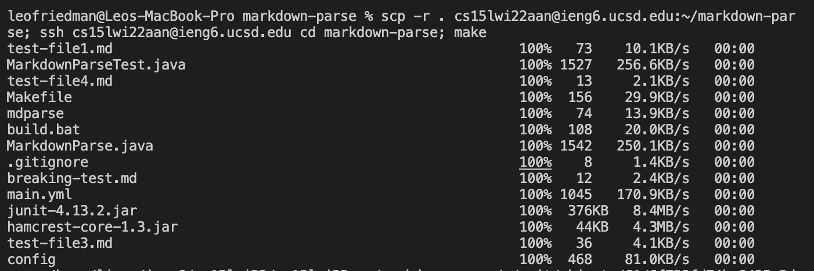
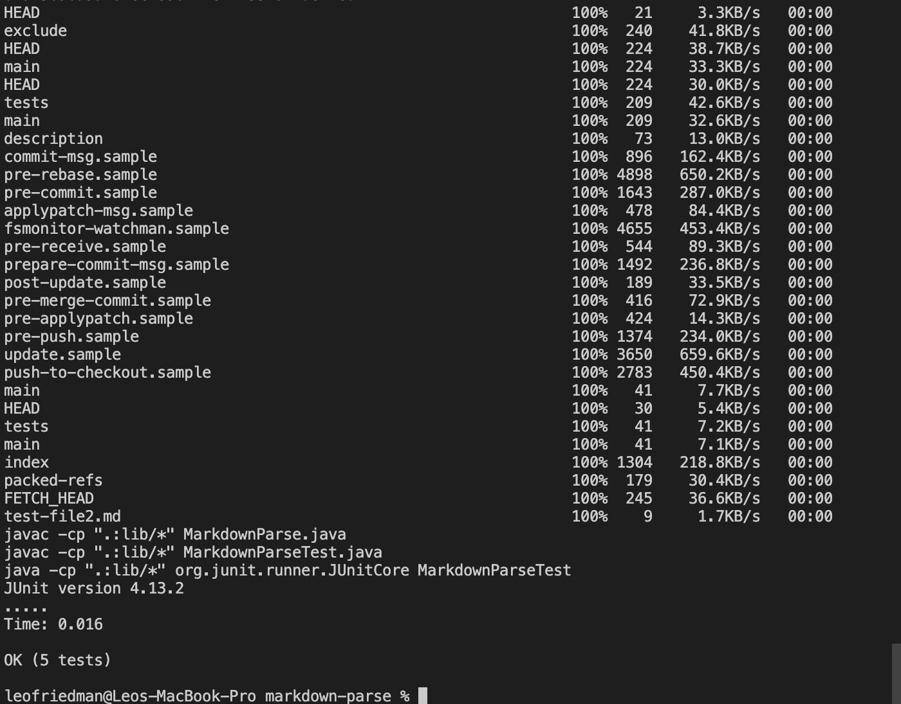

# Lab Choice: Group Choice 3 – Copy Whole Directories

## Part 1. markdown-parse is current working directory

Before I copy anything I make sure my current working directory
is markdown-parse and that all the files I want to copy are there. 

## Part 2. Copy recursively to ssh

Using `scp` I copy my markdown-parse directory from my computer to the remote server.
I include `-r` so that it knows to copy the directory recursively, meaning it will
copy all the contents of the directory as well. 

I use `ssh` to get access to the remote server. 

Then I `cd` into the markdown-parse directory and compile and run my code with
my Makefile. All the tests pass. 

## Part 3. Do it all in one line

Using the command: `scp -r . cs15lwi22aan@ieng6.ucsd.edu:~/markdown-parse; ssh cs15lwi22aan@ieng6.ucsd.edu cd markdown-parse; make`
I am able to perform all the previous tasks in one line of code. The first part of the command copies the markdown-parse
file to the remote server recursively. Then the `;` signifies the second command to be run. This second
command uses `ssh` to get access onto the server. Then two commands are passed into the server command line. 
The first is a `cd` command which changes the current working directory to the markdown-parse directory on the server.
The second command runs my Makefile which compiles my code and runs my tests. All the tests pass. 

