# Lab 4: Markdown Snippets

## Repositories
* [My MarkdownParse Repository](https://github.com/leo3friedman/markdown-parse)
* [Reviewed MarkdownParse Repository](https://github.com/P2fryang/markdown-parse)

## Changed @before code
Before adding more tests I had to add setup code for both MarkdownParses that 
make the tests work. This code ensures that the HashMap is properly set up. 

My MarkdownParse new @before code
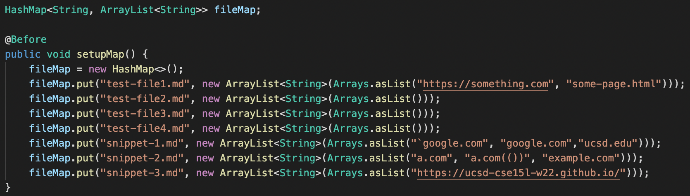

Reviewed MarkdownParse new @before code
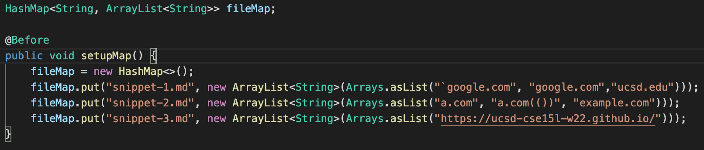

## Snippet 1
- Ideal output: ["`google.com", "google.com","ucsd.edu"]

### My Implementation

New Test:
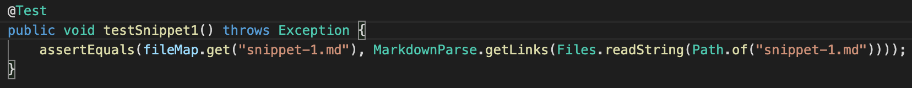

Test Failed Output:
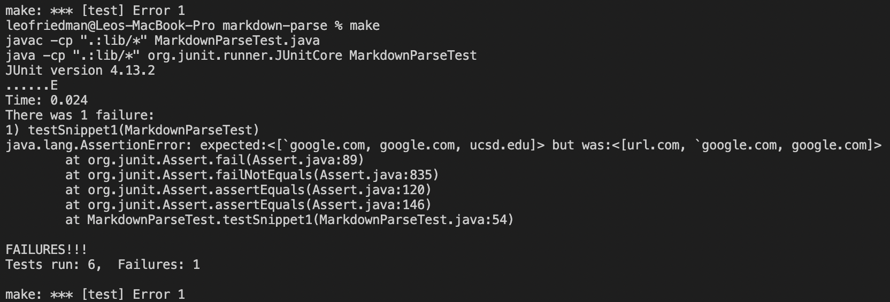

How To Fix: This bug can be solved with a relatively small code change (<10 lines). To
solve it you would have to confirm that none of the link is within an open and a
closed backtick. You could do this by comparing the index of the opening backtick and
the index of the closing backtick with the index of the opening bracket and closing
parentheses. 

### Other Implementation

New Test:
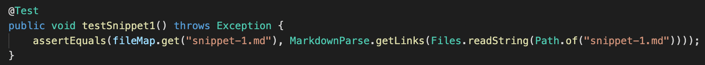

Test Failed Output:
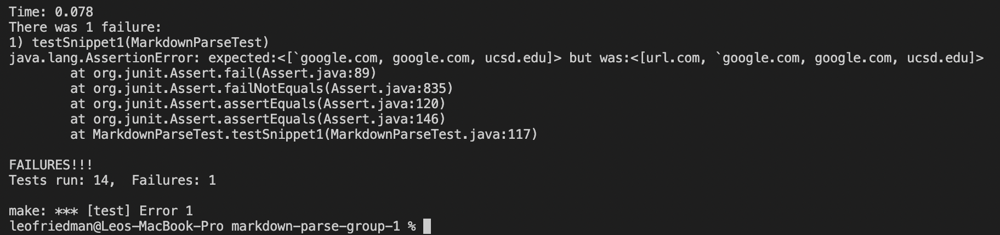

## Snippet 2
- Ideal Output: ["a.com", "a.com(())", "example.com"]

### My Implementation

New Test:
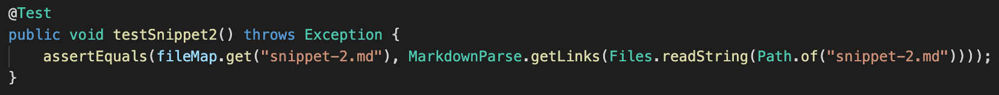

Test Failed Output:
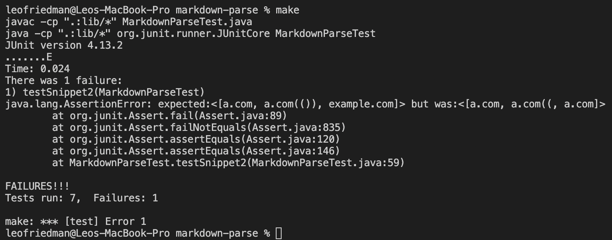

How To Fix: This bug can be solved with a relatively small code change (<10 lines). This
is because you can write a simple function that pairs all of the parentheses. Then you can
determine what the outside pair is and if it follows the syntax of a markdown link. 

### Other Implementation

New Test:
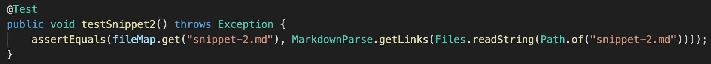

Test Failed Output:
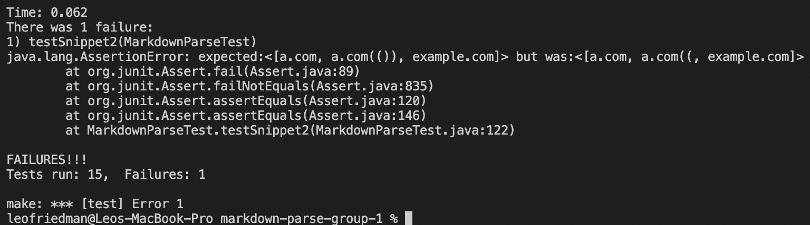

## Snippet 3
- Ideal Output: ["https://ucsd-cse15l-w22.github.io/"]

### My Implementation

New Test:

Test Failed Output:
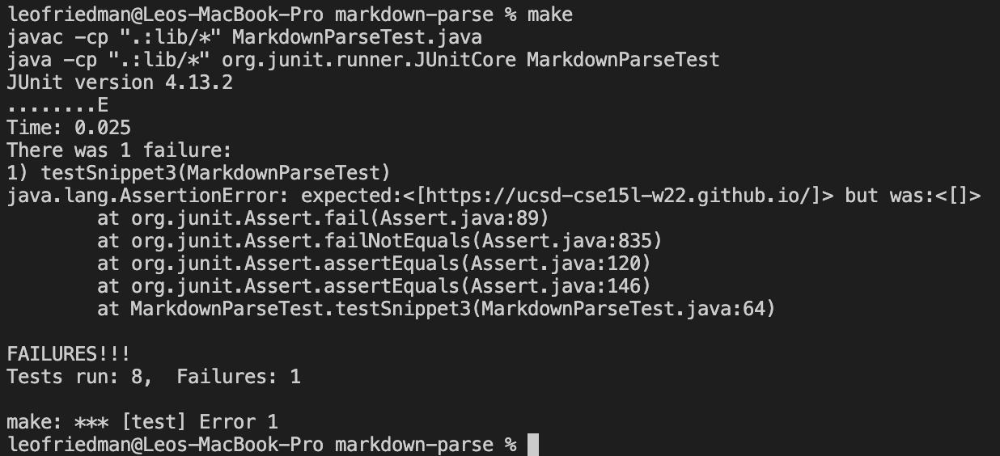

How To Fix: This bug can be solved with a relatively small code change (<10 lines). At
the moment, the program checks if the open paren is one index fron the closed bracket.
Instead you could add logic that if the open parent is two indexes away from the closed 
bracket there must be a single newline in between the closed bracket and the open paren.

### Other Implementation

New Test:
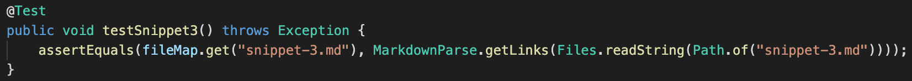

Test Failed Output:

