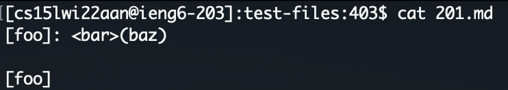

# Lab Report 5: Finding Differences

## Running all tests
To run each test on my-markdown-parse and the given markdown parse I used a bash script. 
This script uses a for loop to loop over each tester file. Then it prints out the file name and runs the
test for each one.  

## Storing the test results
To store the result, I ran the bash script of the given markdown parse and 
passed the results into a txt file  

Then I did the same for my markdown parse  

## Find the differences
To find differences in the test results I ran `diff` on both results text files. 
I stored the differences in another text file to view it. 

For the next part I choose to review the first two differences, test-files/194.md and
test-files/201.md  

## Test 1: test-files/194.md
This is the contents of test-files/194.md  

The expected output is found when passing the contents of the test to commonmark.js. In this
case, the expected outcome should be `[my_(url)]`.  

**The Fix:** 
- Both of the markdown parse files return the wrong output. Mine returns `[]` and the
other one return `[url]` (as shown above). The expected outcome however is `[my_(url)]`.
- The bug in my markdown parse is that we are not looking for brackets followed by a colon.
We only consider a link, a link if it is brackets immediately followed by parentheses. We can
add logic to also assume the link is valid when the closing bracket is immediately followed by
a colon. 
- Code to be fixed (add logic in the red area checking for colon):  

## Test 2: test-files/201.md
This is the contents of test-files/201.md  

The expected output is found when passing the contents of the test to commonmark.js. In this
case, the expected outcome should be `[]` as there are no links that show up.  

**The Fix:**
- Only the given markdown parse file (not mine) returns the wrong output. Mine returns `[]` and the
  other one returns `[baz]` (as shown above). The expected outcome however is `[]`.
- The bug in the other markdown parse is that it is not checking for valid characters following the
colon. In this case, <bar> is not a valid url, the < character should have been a signal to the 
markdown parse of this. To fix this we can add logic that makes sure the text following the 
colon is valid. 
- Code to be fixed (add logic in the red area checking for invalid character):  
  

